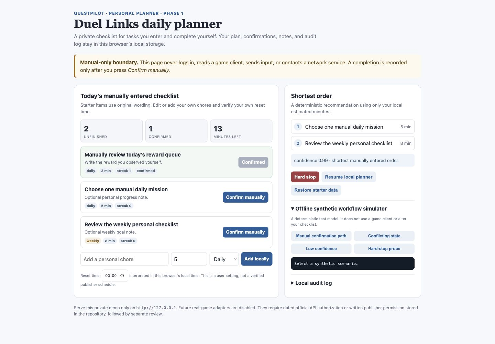

# DNFscript / QuestPilot Phase 1

The historical scripts below are archived context only. **Do not run them
against any commercial game.** QuestPilot Phase 1 adds a deterministic,
offline-only mock and safety-gated vertical slice with no capture backend,
credentials, network client, input injection, or third-party dependency.

Run the fixed benchmark:

```bash
PYTHONPATH=. python3 -m questpilot.benchmark
PYTHONPATH=. python3 -m unittest discover -s tests -v
```

The agent defaults to dry-run; the in-memory mock is the only execution target.
See `docs/PERMISSION_MATRIX.md` and `docs/BUSINESS_GATE.md` before considering
any future integration.

## Duel Links personal planner (local manual Phase 1)

`demo/duel-links-planner.html` is an original, local-only checklist UI for
chores that **you enter and complete yourself**. It keeps its checklist,
reset-time preference, streaks, reward notes, and audit history in that
browser's local storage. It never receives a Duel Links login, reads a client,
uses OCR/capture, sends clicks or keys, or makes a network request.

Run it only on loopback:

```bash
python3 -m http.server 8081 --bind 127.0.0.1 --directory demo
```

Open <http://127.0.0.1:8081/duel-links-planner.html>. Press **Confirm
manually** only after you have done the task yourself. The UI recommends the
shortest unfinished task order from your own estimates, offers a deterministic
offline workflow simulator, and exposes a hard stop plus local audit log.



The editable starter configuration is
`config/duel_links_tasks.json`; it uses original text and deliberately labels
the reset time as a user setting rather than a verified publisher schedule.
See `docs/DUEL_LINKS_PERMISSION_GATE.md`: live Duel Links automation remains
blocked. The repository contains no Duel Links adapter; any future proposal
requires dated official API authorization or written publisher permission
stored in the repository, then separate review.

Validate the local planner and all preserved QuestPilot safety gates:

```bash
PYTHONPATH=. python3 -m py_compile questpilot/*.py
PYTHONPATH=. python3 -m unittest discover -s tests -v
PYTHONPATH=. python3 -m questpilot.benchmark
PYTHONPATH=. python3 -m questpilot.product_benchmark
```

The first publisher-supported extension is a bounded Minecraft Education
Code Builder Agent script. See `adapters/minecraft_education/README.md` and
`docs/ADAPTER_ROADMAP.md`; it runs only in an owned/demo Education world and
does not automate consumer or commercial live-game clients.

For a free local integration, use the Luanti (formerly Minetest) test-world
adapter at `adapters/luanti/`. It is a singleplayer-only Lua mod that owns and
collects only its own seeded test tokens.

# Historical prompt (not an execution guide)

## 1. jitan

## 2. catcard

current code is a hard code script, i want to add an ability to see the screen, the pixcel at certain position of the screen. with this function we can detect certain event to trigger the action. include:


1. enter the level:  move (hold joystick at 1225,334, drag to right for 1 second, then release.) select map:(click at 1350,307, click at 1267,205, click at 1755,404)
2. clear the level: hold the attack at 1779, 400, until the level is clear.
3. the current level is clear 1492,418 became this color: back to the town: (click at 1750,88 then at 1725,425, then click at 1436,291)

loop through 1 2 3

## [0625 4 attack mode]
refer to the current jitan.py, but use 4 attack mode.
currently, left edge start jitan, right edge pause.
add 2 mode:
now i want to add 2 mode, 
top edge -> loop hold attack for 3 sec then click one of the skill buttom randomly, repeatedly foever
skill buttom:
skill 1-7: 1590,400 1665,400 1620,350 1685,350 1750,350 1718,300 1780,300; skill 
8-11: 1660,250, 1700,250, 1750,250, 1785,250
drag skill 1-4: 1660,300: hold and drag up-1, down-2, left-3, right-4

left edge -> the jitan original left logic, but update, insert a action of click one of skill in 8-11 randomly, after 4 hold attacks and befor the 2 click 

down edge -> the catcard logic, refer to catcard.py

## [0624 deprecated]3. enhance jitan, to use the last 4 PL to 
background: 
PL value: every time into a jitan level it need more than 6 PL, when PL is not enouph, you cannot go into the level. use this to play another level 黑暗大地

after implement the catcard.py, we find a way to  detect the event. now rewrite the jitan refer to it ,
the logic became:
fight  using original logic, hold the attack repeatedly,
fight until the level finished event, pick up all item by hold the attack 4 time and enter the next level.
if the PL is not enough, enter the 黑暗大地 level.

 enabling the detect of  :

here is the event to detect
PL value used up: 
- event: badger showup: 疲劳值不足 ， 
- detect it by the 1462,192 turn white.
- action: click at button  返回城镇 at 1777,164
- extra action:  enter the 黑暗大地 level( click at 1127,85,click at 1404,327, click 1800,412), and keep hold original script loop of in holdscript-jitan.


level finished(both for jitan and 黑暗大地):
- event: button of 再次挑战 or 返回城镇 show up
- how to detect: 
- action: pick up all items(by hold the attack at 1797, 404 for 1 seconds for 4 times), thenclick the button of 再次挑战.


level finished:
- event: button of 再次挑战 or 返回城镇 show up(1666,109 became white)
- how to detect: 
- action: pick up all items(by hold the attack at 1797, 404 for 1 seconds for 4 times), thenclick the button of 再次挑战.

PL value used up: 
- event: badger showup: 疲劳值不足 ， 
- detect it by the 1462,192 turn white.
- action: click at button  返回城镇 at 1777,164
- extra action: if running holdscript-jitan, enter the 黑暗大地 level( click at 1127,85,click at 1404,327, click 1800,412), and keep hold original script loop of in holdscript-jitan.


## 4.  refactor the code
consider using behavior tree or state machine, since you are basically controling a game agent. hide the low level details buttom click from the upper level.

detect the words on the screen:

class for event detection
write a class to implement the below event detection:
terms list
PL value: every time into a level, costs 1-4 PL, when PL is not enouph, you cannot go into the level.
one level is consist of multple sublevel, when one sublevel is clear, the next sublevel is open and the color of the door will change(for catcard level, see the holdscript-catcard.py). btw, for bonus level like jitan, there is only one sublevel, so the color of the door will not change.


next level is open:
- see the catcard.py

level finished:
- event: button of 再次挑战 or 返回城镇 show up
- how to detect: 
- action: pick up all items(by hold the attack at 1797, 404 for 1 seconds for 4 times), thenclick the button of 再次挑战.

PL value used up: 
- event: badger showup: 疲劳值不足 ， 
- detect it by the 1462,192 turn white.
- action: click at button  返回城镇 at 1777,164
- extra action: if running holdscript-jitan, enter the 黑暗大地 level( click at 1127,85,click at 1404,327, click 1800,412), and keep hold original script loop of in holdscript-jitan.

first time reenter the level:


weapon need to be repaired: 


1. the notice window at 1555,323 became this color , action is click at 1420,274 then, click at 1555,323
## 4. holdscrip-catcard
